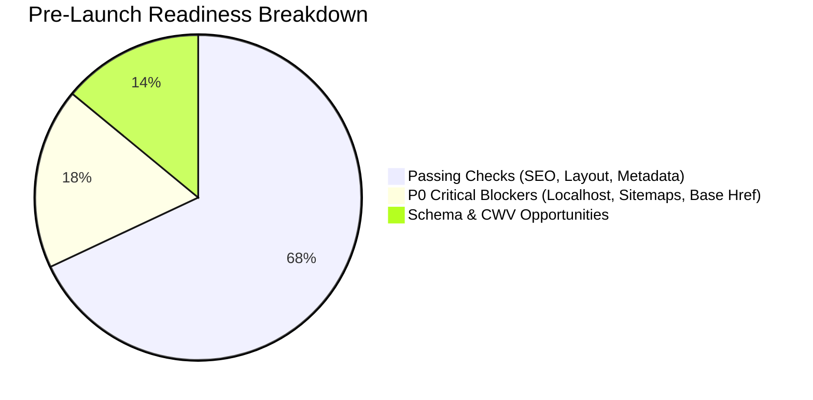

# Global Salah — Comprehensive Technical & SEO Pre-Launch Audit Report

> **Target Staging URL:** `https://crmapi.designstime.com`  
> **Target Production Domain:** `https://globalsalah.com`  
> **Audit Type:** Full Hardcore Technical SEO, Schema Architecture, Performance, Security & Launch-Readiness Audit  
> **Audit Date:** September 2026  
> **Overall Pre-Launch Health Score:** **68 / 100** (🔴 **LAUNCH BLOCKED** — P0 issues must be resolved before live DNS cutover)

---

## 🎯 Executive Summary & Verdict

This repository contains the complete A-to-Z technical, SEO, schema, performance, and infrastructure audit conducted on **Global Salah** (`https://crmapi.designstime.com`).

While the website boasts rich features, extensive internationalization across 10 languages, 1,100+ city prayer schedules, authentic hadith collections, and client-side calculators, **5 CRITICAL P0 BUGS** were uncovered that would severely harm search engine rankings, cause indexing failures, and leak development URLs to Google if launched in its current state.



---

## 🚨 Top 5 Critical Launch Blockers (P0)

| Priority | Issue | Location | Impact if Launched | Fix Time |
| :--- | :--- | :--- | :--- | :--- |
| 🔴 **P0** | **Sitemaps Hardcoded with `localhost`** | `blog-sitemap.xml`, `forum-sitemap.xml` | 100% crawl failure on blog & forum in Google Search Console | 15 mins |
| 🔴 **P0** | **JSON-LD Schemas pointing to `localhost`** | All `/blog/*` article templates | Broken rich snippets, invalid schema entity IDs in Google | 20 mins |
| 🔴 **P0** | **Character Encoding Corruption (``, `?Ts`)** | Breadcrumbs, Schemas, Duas, Hadith | Broken user experience, malformed search snippets (`sunTs position`) | 30 mins |
| 🔴 **P0** | **`<base href="./">` & Dot-Slash Link Collisions** | Global `<head>` & Nav menus | 404 broken links on sub-pages (e.g. `/countries/pakistan/./blog/`) | 25 mins |
| 🔴 **P0** | **Staging Domain Indexation Leakage** | `robots.txt`, Meta Robots | Duplicate content penalty, `crmapi.designstime.com` indexed in SERPs | 10 mins |

---

## 📂 Audit Documentation Structure

All deep-dive reports and ready-to-use production assets are organized into modular files:

| Folder / File | Description |
| :--- | :--- |
| 📄 [`audit-reports/01-executive-summary.md`](./audit-reports/01-executive-summary.md) | High-level risk analysis, health scorecard, and executive breakdown. |
| 📄 [`audit-reports/02-critical-launch-blockers.md`](./audit-reports/02-critical-launch-blockers.md) | Deep inspection of all 5 P0 blockers with exact code diffs to fix. |
| 📄 [`audit-reports/03-technical-seo-and-crawlability.md`](./audit-reports/03-technical-seo-and-crawlability.md) | Robots.txt, sitemaps, canonicals, hreflangs (10 languages), URLs, 404s. |
| 📄 [`audit-reports/04-schema-opportunities-and-structured-data.md`](./audit-reports/04-schema-opportunities-and-structured-data.md) | **Deep-dive on Schema Opportunities** (`WebApplication`, `Place`, `Book`, `Event`, `AudioObject`). |
| 📄 [`audit-reports/05-performance-and-core-web-vitals.md`](./audit-reports/05-performance-and-core-web-vitals.md) | CSS/JS over-bundling (~700KB total payload), asset caching, WebP/AVIF. |
| 📄 [`audit-reports/06-security-headers-and-server-configuration.md`](./audit-reports/06-security-headers-and-server-configuration.md) | LiteSpeed server security headers (HSTS, CSP, X-Frame-Options, CORS). |
| 📄 [`audit-reports/07-ui-ux-accessibility-and-multilingual.md`](./audit-reports/07-ui-ux-accessibility-and-multilingual.md) | RTL support, touch targets, ARIA accessibility, mobile viewports. |
| 📄 [`audit-reports/08-pre-launch-and-migration-checklist.md`](./audit-reports/08-pre-launch-and-migration-checklist.md) | Step-by-step checklist to go live safely on `https://globalsalah.com`. |
| 📁 [`schemas-library/`](./schemas-library/) | Ready-to-copy validated JSON-LD schema files for developers. |
| 📁 [`server-config/`](./server-config/) | Pre-configured `.htaccess` and `nginx.conf` with security headers & caching. |
| 📁 [`scripts/`](./scripts/) | Automated PowerShell crawlers and verification scripts. |

---

## ⚡ Quick Fix Cheat Sheet

### 1. Fix Sitemaps & Blog Schemas
Replace `http://localhost/Global_Salah_New/site/public/` with `https://globalsalah.com/` in your sitemap generator and template engine.

### 2. Remove `<base href="./">`
Remove line 9 from all page templates:
```diff
-<base href="./"><script>if(location.protocol==="file:")document.querySelector("base").setAttribute("href","./")</script>
```
Ensure all navigation links use absolute paths (e.g., `href="/blog/"` instead of `href="./blog/"`).

### 3. Add Security Headers (`.htaccess` for LiteSpeed)
Copy the contents of [`server-config/.htaccess`](./server-config/.htaccess) into your web root.

### 4. Inject Missing High-Impact Schemas
Add `WebApplication` schema to all calculators and `Place` / `GeoCoordinates` schema to city prayer pages from the [`schemas-library/`](./schemas-library/) folder.

---

*Audit conducted and compiled for repository:*  
`https://github.com/saifullahkhatri99-blip/website-audit`
