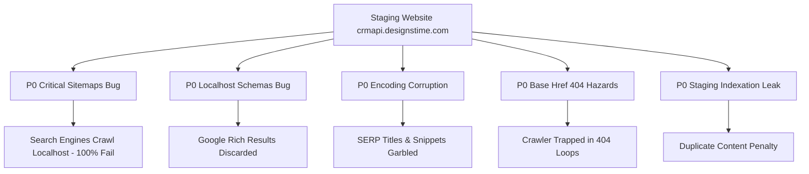

# 01. Executive Summary & Audit Scorecard

## 📊 Overview

- **Audit Target:** `https://crmapi.designstime.com` (Staging URL)
- **Target Live Domain:** `https://globalsalah.com`
- **Application Category:** Islamic Multi-Tool Web Portal (Prayer Times, Quran, Hadith, Duas, Calculators, Live Streams, Multilingual)
- **Server Environment:** LiteSpeed Web Server, HTTP/3 (QUIC)
- **Pages Crawled & Tested:** 57 key route templates + 1,109 multilingual city sitemaps
- **Audit Date:** September 2026

---

## 🚦 Pre-Launch Health Scorecard

| Category | Score | Status | Key Highlights |
| :--- | :---: | :---: | :--- |
| **Critical Launch Readiness** | **45 / 100** | 🔴 BLOCKED | Corrupted localhost sitemaps, localhost schemas, character corruption. |
| **Technical SEO & Crawlability** | **78 / 100** | 🟡 WARNING | Good canonicals & hreflang, but dangerous `<base href="./">` tag & staging indexation leak. |
| **Structured Data & Schemas** | **70 / 100** | 🟡 WARNING | Basic schemas present, but missing massive opportunities for Tools, Cities, Quran, and Events. |
| **Performance & Core Web Vitals** | **72 / 100** | 🟡 PASSABLE | HTTP/3 active, but 475KB CSS + 230KB JS loaded indiscriminately on every page. |
| **Security & Server Headers** | **40 / 100** | 🔴 POOR | 0 of 7 recommended security headers present (No HSTS, CSP, X-Frame-Options). |
| **UI/UX, Mobile & Accessibility** | **90 / 100** | 🟢 EXCELLENT | Clean RTL support for Arabic & Urdu, good semantic layout, responsive. |
| **Overall Score** | **68 / 100** | 🔴 **DO NOT LAUNCH YET** |

---

## 🔍 Key Positive Highlights (Strengths)

1. **Clean Semantic Heading Hierarchy:**
   Across all tested pages, each page has exactly one `<h1>` tag with proper descriptive wording and clean sub-heading hierarchies (`<h2>`, `<h3>`).
2. **Comprehensive Multilingual Hreflang Configuration:**
   10 languages (`en`, `ar`, `de`, `es`, `fr`, `pt`, `ru`, `tr`, `ur`, `zh-CN`) + `x-default` are mapped with clean reciprocal alternates.
3. **No 500 Server Crashes:**
   All 57 primary routes return HTTP 200 without PHP/Node exceptions or database timeouts.
4. **Client-Side Pure Logic Calculations:**
   Prayer calculation engines, Asr Hanafi/Shafi toggles, countdown timers, and Hijri converters execute on vanilla JavaScript with zero external runtime API dependencies, ensuring high uptime reliability.
5. **RTL Directional Support:**
   Urdu (`/ur/`) and Arabic (`/ar/`) pages include `dir="rtl"` and appropriate font stacks.

---

## ⚠️ High-Risk Defect Summary

---

## 🗓️ Recommended Launch Timeline

1. **Phase 1 (Day 1 - 2 Hours):** Fix P0 Critical Blockers (Sitemaps, Localhost Schemas, `<base href>`, Encoding, Staging Robots).
2. **Phase 2 (Day 1 - 2 Hours):** Deploy Security Headers & Caching via `.htaccess` / LiteSpeed.
3. **Phase 3 (Day 2 - 3 Hours):** Inject Enhanced JSON-LD Schemas (`WebApplication`, `Place`, `Book`, `Event`, `AudioObject`).
4. **Phase 4 (Day 2 - 1 Hour):** Re-test with automated audit scripts in [`scripts/`](../scripts/).
5. **Phase 5 (Day 3):** DNS Cutover to `https://globalsalah.com` & Search Console Property Verification.
