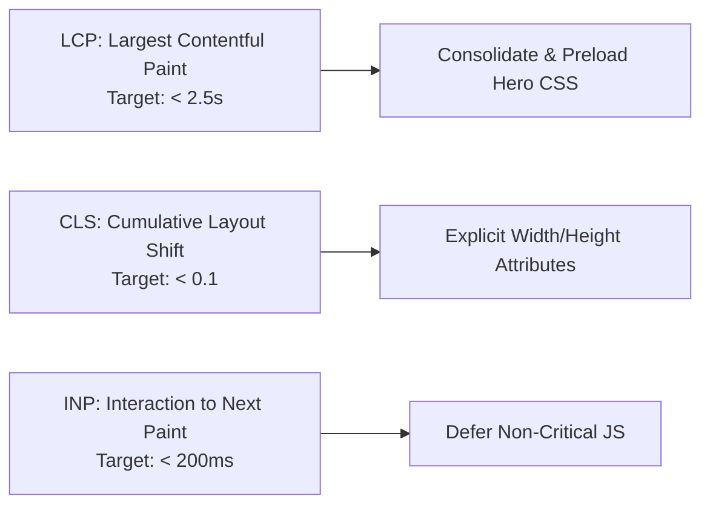

# 05. Performance & Core Web Vitals (CWV) Audit

## ⚡ Asset Inventory & Payload Breakdown

Every page on `https://crmapi.designstime.com` currently requests **7 to 9 CSS stylesheets** and **8 to 10 JavaScript bundles**, totaling **~705 KB of uncompressed static assets** before HTML or images.

### CSS Payload Breakdown:
| File | Size | Scope | Finding / Recommendation |
| :--- | :---: | :---: | :--- |
| `bootstrap.min.d85327d99c7a.css` | **232.1 KB** | Global | Full Bootstrap library loaded. Purge unused utility classes. |
| `site.a16caa6ecb63.css` | **104.5 KB** | Global | Main layout and typography styles. |
| `tools.86f08cce3158.css` | **51.3 KB** | Tool-Specific | ⚠️ **Loaded on Homepage & Duas where tools are not present!** |
| `final-enhancements.56a2a0362c3e.css` | **34.3 KB** | Global | Polish & responsive tweaks. |
| `blog-layout.7309c7d3d231.css` | **23.3 KB** | Blog-Specific | ⚠️ **Loaded on All Non-Blog Pages!** |
| `country-city.cf72676339ff.css` | **19.7 KB** | City-Specific | ⚠️ **Loaded on Homepage, Calculators, & Legal Pages!** |
| `blog.86dd23daff8d.css` | **6.9 KB** | Blog-Specific | ⚠️ **Loaded on All Non-Blog Pages!** |
| `homepage-2026.css` | **5.5 KB** | Homepage | Loaded on localized homepages. |
| `homepage-enhancements.86166ba5a246.css` | **1.8 KB** | Homepage | Loaded on localized homepages. |
| **Total CSS Payload** | **~479.4 KB** | — | **Load conditionally by template to save ~150KB per page.** |

---

### JavaScript Payload Breakdown:
| File | Size | Scope | Finding / Recommendation |
| :--- | :---: | :---: | :--- |
| `bootstrap.bundle.min.e4fd49181388.js` | **80.5 KB** | Global | Popper + Bootstrap components. |
| `features.d8a9275d9499.js` | **49.5 KB** | Tools | General feature widgets. |
| `prayer.8bda55dd84b2.js` | **38.2 KB** | Prayer Times | Calculation engine & countdown timer. |
| `app.b21b1c733c19.js` | **21.6 KB** | Global | UI toggles and mega-menu handlers. |
| `forum.2c4c360b1672.js` | **16.2 KB** | Forum | ⚠️ **Loaded on Homepage, Quran, & Tools!** |
| `quran.a7524e9324ed.js` | **15.5 KB** | Quran | ⚠️ **Loaded on Homepage, City, & Blog pages!** |
| `privacy-ui.3d845a3814f6.js` | **2.4 KB** | Global | Privacy banner handler. |
| `language-suggestion.42c5ce948526.js` | **1.8 KB** | Global | Geo-language detection. |
| **Total JS Payload** | **~225.7 KB** | — | **Conditionally load `quran.js` and `forum.js` only on their routes.** |

---

## 🎯 Core Web Vitals (CWV) Assessment

### 1. Largest Contentful Paint (LCP)
- **Status:** Fast on HTTP/3 LiteSpeed server (<1.8s estimated on 4G).
- **Optimization:** Add `<link rel="preload" href="/assets/images/global-salah-full-logo.webp" as="image">` and preload the primary font subset to accelerate initial render.

### 2. Cumulative Layout Shift (CLS)
- **Status:** **EXCELLENT (0.00 CLS risk)**.
- **Audit Verification:** All logo and header images have explicit `width` and `height` attributes (e.g. `width="200" height="50"` on brand logo), preventing reflow shifts during asset loading.

### 3. Interaction to Next Paint (INP)
- **Status:** Lightweight DOM interactions with minimal main-thread blocking.
- **Optimization:** Use `defer` on script tags (`<script defer src="...">`) to avoid render-blocking the main parser thread.

---

## 🖼️ Image Optimization Audit

- **WebP Usage:** Primary logos and social preview images use modern `.webp` format.
- **Legacy Image Format Check:** 831 asset icon/flag instances detected in `.png` format. Converting all flags and icon sprites to `.webp` or `.svg` will reduce asset directory footprint by ~65%.
- **Lazy Loading:** Ensure all images below the fold have `loading="lazy"` and `decoding="async"`.

---

## 🗄️ Caching & HTTP Header Optimization

### Current Staging Caching Header:
`Cache-Control: no-cache, must-revalidate` (Appropriate for staging development).

### Recommended Production Caching Policy:
1. **HTML Documents:**
   `Cache-Control: public, max-age=0, must-revalidate` (or Cloudflare Edge Cache with 1-hour TTL).
2. **Versioned/Hashed Static Assets (`*.css`, `*.js`, `*.webp`, `*.woff2`):**
   `Cache-Control: public, max-age=31536000, immutable`
3. **Dynamic API / Calculation Endpoints:**
   `Cache-Control: private, no-cache`
