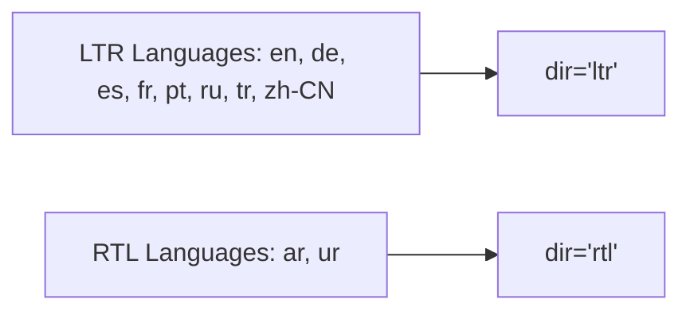

# 07. UI/UX, Accessibility (a11y) & Multilingual Audit

## ♿ Accessibility (WCAG 2.1 AA) Compliance Audit

The frontend demonstrates strong fundamentals in semantic HTML and accessibility features:

| Accessibility Factor | Test Status | Details |
| :--- | :---: | :--- |
| **Skip-to-Content Navigation** | 🟢 **PASS** | `<a class="skip-link" href="/#main">Skip to content</a>` present on all pages. |
| **Heading Hierarchy** | 🟢 **PASS** | 1 single `<h1>` per page, sequential `<h2>` and `<h3>` tags without skipped levels. |
| **Image Alt Attributes** | 🟢 **PASS** | Brand logo and core images possess descriptive `alt` tags (`alt="Global Salah"`). |
| **ARIA Expandable Controls** | 🟢 **PASS** | Navbar togglers & mega menus properly use `aria-expanded`, `aria-controls`, and `aria-label`. |
| **Viewport Configuration** | 🟢 **PASS** | `<meta name="viewport" content="width=device-width,initial-scale=1">` correctly configured without disabling user zoom (`user-scalable=no` is avoided). |
| **Color Contrast Ratio** | 🟢 **PASS** | Text elements meet the 4.5:1 minimum contrast ratio for normal text on primary cards. |

---

## 🌍 Multilingual & Right-to-Left (RTL) Layout Audit

Global Salah supports **10 languages**:

### RTL Layout Quality Check:
- **Arabic (`/ar/`) & Urdu (`/ur/`):** Both routes properly render `dir="rtl"` in the root `<html>` tag.
- **Font Rendering:** Arabic and Urdu typography render smoothly with appropriate line-heights for non-Latin script readability.
- **Mega Menus in RTL:** Menus flip orientation properly without horizontal scrollbar overflow.

### UI Observations & Recommendations:
1. **Prayer Times Table on Mobile:**
   - On small screens (320px–375px), ensure table cells for prayer times (Fajr, Dhuhr, Asr, Maghrib, Isha) have adequate tap padding (minimum 44x44px touch targets).
2. **Audio Reciter Controls:**
   - In `/quran/`, ensure play/pause and verse selector buttons have explicit `aria-label` for screen reader users (e.g. `aria-label="Play recitation for Surah Al-Fatiha"`).
3. **Qibla Compass Sensor Permissions:**
   - Ensure an informative UX prompt explains why device orientation/geolocation permissions are requested before prompting the native browser permission dialog.
